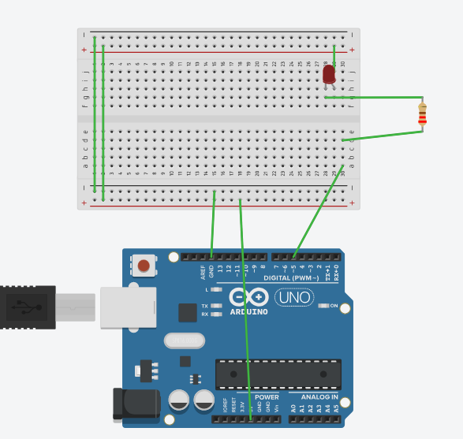
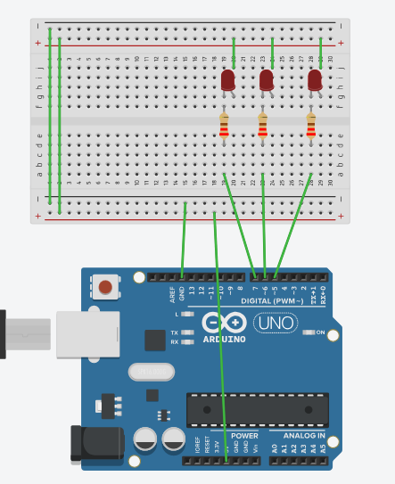
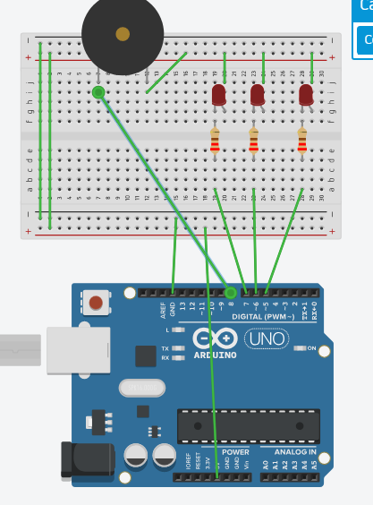
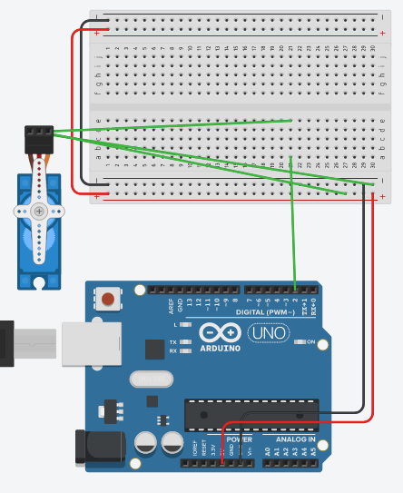
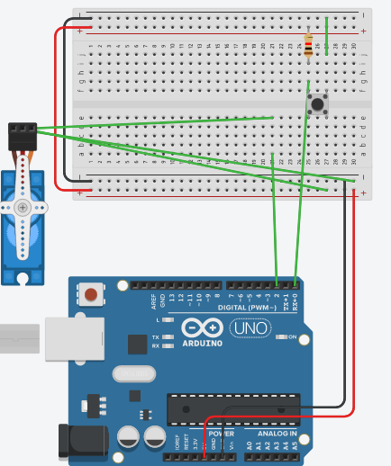
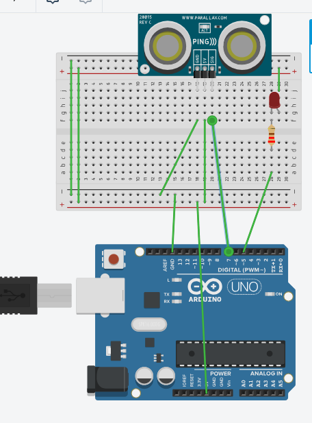

# Practicas de Entornos de desarrollo. Ejercicios de programación en entorno Arduino

## Practica 1
Encender y apagar un LED

Imagen del circuito

```
#define LED 5
void setup() {
  pinMode(LED, OUTPUT);
}

void loop() {
  digitalWrite(LED, HIGH);
  delay(1000);
  digitalWrite(LED, LOW);
  delay(1000);
}
```


## Practica 2
Encender y apagar tres LEDs de forma consecutiva

Imagen del circuito

```
#define LED1 5
#define LED2 6
#define LED3 7
void setup() {
  pinMode(LED1, OUTPUT);
  pinMode(LED2, OUTPUT);
  pinMode(LED3, OUTPUT);
}

void loop() {
  digitalWrite(LED1, HIGH);
  delay(100);
  digitalWrite(LED1, LOW);
  delay(100);
  digitalWrite(LED2, HIGH);
  delay(100);
  digitalWrite(LED2, LOW);
  delay(100);
  digitalWrite(LED3, HIGH);
  delay(100);
  digitalWrite(LED3, LOW);
  delay(100);
}
```
[Video de la practica 2](img/4-LEDs.mp4)

Modificaciones sollicitadas:
```
// Ahora parpadearan cada vez más rapido
#define LED1 5
#define LED2 6
#define LED3 7
#define INICIO 100

int retardo;
void setup() {
  pinMode(LED1, OUTPUT);
  pinMode(LED2, OUTPUT);
  pinMode(LED3, OUTPUT);
  retardo = INICIO;
}

void loop() {
  digitalWrite(LED1, HIGH);
  delay(retardo);
  digitalWrite(LED1, LOW);
  delay(retardo);
  digitalWrite(LED2, HIGH);
  delay(retardo);
  digitalWrite(LED2, LOW);
  delay(retardo);
  digitalWrite(LED3, HIGH);
  delay(retardo);
  digitalWrite(LED3, LOW);
  delay(retardo);

  retardo--;
  if (retardo <=0)
  	retardo = INICIO;
}
```

```
// Ahora parpadearan todas a la vez
#define LED1 5
#define LED2 6
#define LED3 7
#define INICIO 1000

int retardo;
void setup() {
  pinMode(LED1, OUTPUT);
  pinMode(LED2, OUTPUT);
  pinMode(LED3, OUTPUT);
  retardo = INICIO;
}

void loop() {
  digitalWrite(LED1, HIGH);
  digitalWrite(LED2, HIGH);
  digitalWrite(LED3, HIGH);
  delay(retardo);
  digitalWrite(LED1, LOW);
  digitalWrite(LED2, LOW);
  digitalWrite(LED3, LOW);
  delay(retardo);
}
```

```
/*
Ahora se encienden las luces 1 y 3, se apagaran
Luego la 2 y se apaga
*/
#define LED1 5
#define LED2 6
#define LED3 7
#define INICIO 1000

int retardo;
void setup() {
  pinMode(LED1, OUTPUT);
  pinMode(LED2, OUTPUT);
  pinMode(LED3, OUTPUT);
  retardo = INICIO;
}

void loop() {
  digitalWrite(LED1, HIGH);
  digitalWrite(LED3, HIGH);
  delay(retardo);
  digitalWrite(LED1, LOW);
  digitalWrite(LED3, LOW);
  delay(retardo);
  digitalWrite(LED2, HIGH);
  delay(retardo);
  digitalWrite(LED2, LOW);
  delay(retardo);
}
```


## Practica 3
Encender y apagar tres LEDs de forma consecutiva y hacer sonar BUzzer

Imagen del circuito

Codigo inicial:
```
#define pin4 0
#define pin1 4
#define pin2 16
#define pin3 17
#define pinBuzzer 2

int freq = 2000;
int channel = 0;
int resolution = 8;

// the setup function runs once when you press reset or power the board
void setup() {
  // initialize digital pin LED_BUILTIN as an output.
  pinMode(pin1, OUTPUT);
  pinMode(pin2, OUTPUT);
  pinMode(pin3, OUTPUT);
  pinMode(pin4, OUTPUT);
  pinMode(pinBuzzer, OUTPUT);
  ledcSetup(channel, freq, resolution);
  ledcAttachPin(pinBuzzer, channel);
}

// the loop function runs over and over again forever
void loop() {
  ledcWriteTone(channel, 0);
  
  digitalWrite(pin1, HIGH);
  delay(100);
  digitalWrite(pin2, HIGH);
  delay(100);
  digitalWrite(pin3, HIGH);
  delay(100);
  digitalWrite(pin4, HIGH);
  delay(100);

  digitalWrite(pin1, LOW);
  delay(100);
  digitalWrite(pin2, LOW);
  delay(100);
  digitalWrite(pin3, LOW);
  delay(100);
  digitalWrite(pin4, LOW);
  delay(100);
  
  ledcWriteTone(channel, 2000);
  delay(100);
}
```

```
/* Como ejercicio, hemos modificado el
codigo para que aumente la frecuencia
del sonido y diminuya el tiempo de parpadeo */
#define pin4 0
#define pin1 4
#define pin2 16
#define pin3 17
#define pinBuzzer 2

#define RINICIAL 50
#define TINICIAL 1000

int freq = 2000;
int channel = 0;
int resolution = 8;
int retraso;
int tono;


// the setup function runs once when you press reset or power the board
void setup() {
  // initialize digital pin LED_BUILTIN as an output.
  pinMode(pin1, OUTPUT);
  pinMode(pin2, OUTPUT);
  pinMode(pin3, OUTPUT);
  pinMode(pin4, OUTPUT);
  pinMode(pinBuzzer, OUTPUT);
  ledcSetup(channel, freq, resolution);
  ledcAttachPin(pinBuzzer, channel);
  retraso = RINICIAL;
  tono = TINICIAL;
}

// the loop function runs over and over again forever
void loop() {
  ledcWriteTone(channel, 0);
  digitalWrite(pin1, HIGH);
  delay(retraso);
  digitalWrite(pin2, HIGH);
  delay(retraso);
  digitalWrite(pin3, HIGH);
  delay(retraso);
  digitalWrite(pin4, HIGH);
  delay(retraso);
  ledcWriteTone(channel, tono);
  delay(retraso);
  digitalWrite(pin1, LOW);
  delay(retraso);
  digitalWrite(pin2, LOW);
  delay(retraso);
  digitalWrite(pin3, LOW);
  delay(retraso);
  digitalWrite(pin4, LOW);
  delay(retraso);
  retraso -= 5;
  tono += 10;

  if (retraso <= 0) retraso = RINICIAL;
  if (tono >= 5000) tono = TINICIAL;
}
```
[Video de la practica 3](img/4-LED-Buzzer.mp4)


## Practica 4
Manejar un Servo. hacerle girar en ambos sentidos

Imagen del circuito

Codigo inicial:
```
#include <ESP32Servo.h>

#define pinServo 2
#define MI_DELAY 15
#define SERVO_MAX 2400
#define SERVO_MIN 500
#define AVANCE 5


Servo myservo;
int pos;
unsigned long delayStart;
boolean avanza = true;

// the setup function runs once when you press reset or power the board
void setup() {
  Serial.begin(115200);
  //myservo.attach( pinServo );
  myservo.setPeriodHertz(50);
  myservo.attach( pinServo, SERVO_MIN, SERVO_MAX);
  
  delayStart = millis();
  pos = SERVO_MIN;
}


// the loop function runs over and over again forever
void loop() {
  unsigned long curTime = millis();
  
  if ( curTime > (delayStart + MI_DELAY)) {
    delayStart = millis();
    if (avanza == true) myservo.write(pos += AVANCE);
    else myservo.write(pos -= AVANCE);

    if (pos >= SERVO_MAX){ avanza = false;}
    if (pos <= SERVO_MIN){ avanza = true;}

    Serial.print("Posicion: ");
    Serial.print(pos);
    Serial.print(" Avanza: ");
    Serial.println( avanza);
  }
}
```
[Video de la practica 4](img/servo1.mp4)


## Practica 5
Manejar un Servo. hacerle girar una vuelta cada vez que se presiona el boton

Imagen del circuito

Codigo inicial:
```

#include <ESP32Servo.h>

#define pinBoton 0
#define pinServo 2
#define MI_DELAY 2
#define SERVO_MAX 2400
#define SERVO_MIN 500
#define AVANCE 5


Servo myservo;
int pos;
unsigned long delayStart;
boolean avanza;
boolean iniciar;

// the setup function runs once when you press reset or power the board
void setup() {
  Serial.begin(115200);
  //myservo.attach( pinServo );
  myservo.setPeriodHertz(50);
  myservo.attach( pinServo, SERVO_MIN, SERVO_MAX);
  
  delayStart = millis();
  pos = SERVO_MIN;
  avanza = true;
  iniciar = false;
}


// the loop function runs over and over again forever
void loop() {
  unsigned long curTime = millis();

  // El boton está pulsado?
  if ( digitalRead( pinBoton) == false) {
    iniciar = true;
  }


  // Controlar la posicion del Servo
  if ((iniciar) && ( curTime > (delayStart + MI_DELAY))) {
    delayStart = millis();
    if (avanza == true) myservo.write(pos += AVANCE);
    else myservo.write(pos -= AVANCE);

    if (pos >= SERVO_MAX){ avanza = false;}
    if (pos <= SERVO_MIN){ avanza = true; iniciar = false;}

    Serial.print("Posicion: ");
    Serial.print(pos);
    Serial.print(" Avanza: ");
    Serial.println( avanza);
  }
}
```
[Video de la practica 5](img/servo2.mp4)


## Practica 6
Usar un sensor de proximidad

Imagen del circuito

Codigo:
```
#define pin4 0
#define pin1 4
#define pin2 16
#define pin3 17
#define pinBuzzer 2

#define pinLED 15
#define TINICIAL 1000
#define pinT 19
#define pinEcho 18

int duracion;


// the setup function runs once when you press reset or power the board
void setup() {
  // initialize digital pin LED_BUILTIN as an output.
  pinMode(pinT, OUTPUT);
  pinMode(pinLED, OUTPUT);
  pinMode(pinEcho, INPUT);
  Serial.begin(115200);
}

int estado = 0;

// the loop function runs over and over again forever
void loop() {
   // Clears the trigPin
  digitalWrite(pinT, LOW);
  delayMicroseconds(2);
  
  // Sets the trigPin on HIGH state for 10 micro seconds
  digitalWrite(pinT, HIGH);
  delayMicroseconds(10);
  digitalWrite(pinT, LOW);
  
  // Reads the echoPin, returns the sound wave travel time in microseconds
  duracion = pulseIn(pinEcho, HIGH);

  Serial.print( "Distancia: ");
  Serial.println( duracion );

  if ( duracion < 1000) {
    digitalWrite(pinLED, HIGH);
  }
   else {
    digitalWrite(pinLED, LOW);
   }
}
```

Dejamos una modificación con la que se hacen sonidos entre valores de distancias de 100 a 3000, a modo de Teremín
```
#define pin4 0
#define pin1 4
#define pin2 16
#define pin3 17
#define pinBuzzer 2

#define pinLED 15
#define tono 1000
#define pinT 19
#define pinEcho 18
#define pinBuzzer 2

int duracion;
int freq = 2000;
int channel = 0;
int resolution = 8;

// the setup function runs once when you press reset or power the board
void setup() {
  // initialize digital pin LED_BUILTIN as an output.
  pinMode(pinT, OUTPUT);
  pinMode(pinLED, OUTPUT);
  pinMode(pinEcho, INPUT);
  pinMode(pinBuzzer, OUTPUT);
  ledcSetup(channel, freq, resolution);
  ledcAttachPin(pinBuzzer, channel);
  ledcWriteTone(channel, 0);
  Serial.begin(115200);
}

int estado = 0;

// the loop function runs over and over again forever
void loop() {
   // Clears the trigPin
  digitalWrite(pinT, LOW);
  delayMicroseconds(2);
  
  // Sets the trigPin on HIGH state for 10 micro seconds
  digitalWrite(pinT, HIGH);
  delayMicroseconds(10);
  digitalWrite(pinT, LOW);
  
  // Reads the echoPin, returns the sound wave travel time in microseconds
  duracion = pulseIn(pinEcho, HIGH);

  Serial.print( "Distancia: ");
  Serial.println( duracion );

  if (duracion > 3000)
    duracion = 0;

  if (duracion < 500)
      duracion = 0;
      
   ledcWriteTone(channel, duracion);
     
  if ( duracion < 1000) {
    digitalWrite(pinLED, HIGH);
  }
   else {
    digitalWrite(pinLED, LOW);
   }

   delay(30);
}
```